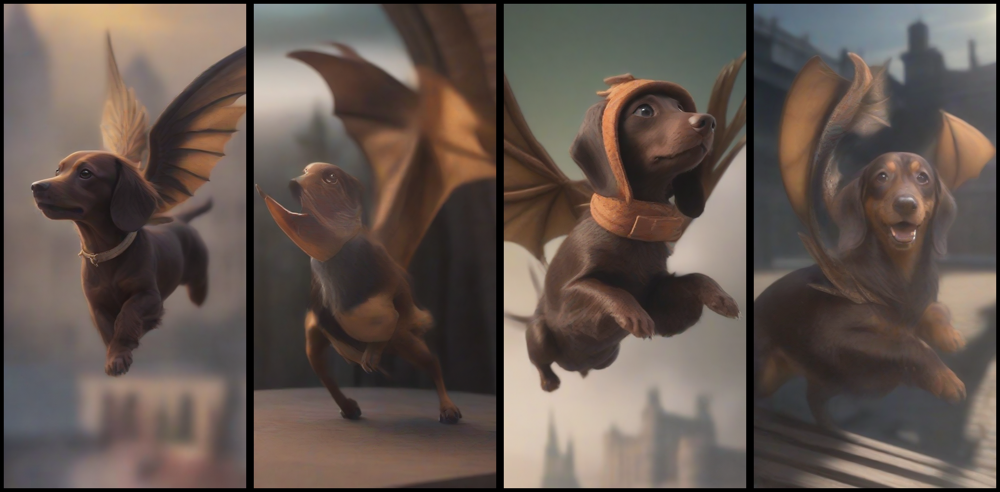
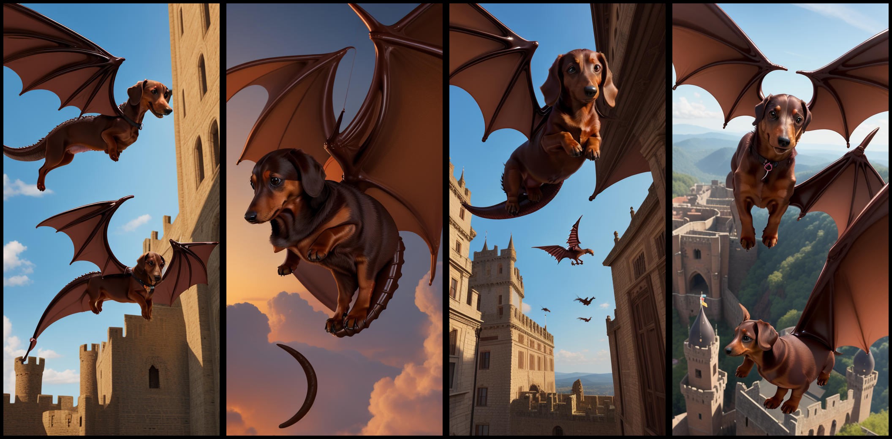

# Stable Diffusion With Apple MLX and Support For Single File Models

This is based on [MLX Example for Stable Diffusion](https://github.com/ml-explore/mlx-examples/tree/main/stable_diffusion) and adds support for single file models in safetensors format like the ones you can find on [Civitai](https://civitai.com/).

## Text to Image

The `txt2image.py` script was modify to add `--single_-file` argument that allows to select a single file model in safetensors format. The model will be automatically unpacked and cached for future use.  You still need to use the `--model` argument to select the model type that the single file model is based on.  The available base models are `sdxl` and `sd`.  If you use a single file model, the `--model` argument is required.  However, if you use a `--model` argument without `--single_file` the base StabilityAI model will be downloaded from HuggingFace and used.

The `txt2image.py` was also modified to add `--height` and `--width` to allow control of the output image size instead of the hardcoded default.  Notice that the height and width define the latent space size and not the output image size.  For example, if you use `--height 128 --width 64` the output image will be 512x1024 pixels.

Here are some examples of how to use the `--single_file` argument:

SDXL Example:
```shell
python txt2image.py "A chocolate caramel Dachshund with wings of a dragon flying over the castel, photorealistic, 8k" --n_images 4 --n_rows 1 --model sdxl --single-file /Users/robertsliwa/Downloads/sdxlYamersRealistic5_v5Rundiffusion.safetensors --steps 15 --negative_prompt "bad quality, bad anatomy, worst quality, low quality, low resolution, extra fingers, blur, blurry, ugly, wrong proportions, watermark, image artifacts, lowres, ugly,  jpeg artifacts, deformed, noisy image, deformation" --height 128 --width 64 --output sdxl_example.png
```



SD Example:
```shell
python txt2image.py "A chocolate caramel Dachshund with wings of a dragon flying over the castel, photorealistic, 8k" --n_images 4 --n_rows 1 --model sd --single-file /Users/robertsliwa/Downloads/perfectdeliberate_v5.safetensors --steps 15 --negative_prompt "bad quality, bad anatomy, worst quality, low quality, low resolution, extra fingers, blur, blurry, ugly, wrong proportions, watermark, image artifacts, lowres, ugly,  jpeg artifacts, deformed, noisy image, deformation" --height 128 --width 64 --output sd_example.png
```



## Image to Image

Here is example how to use the `image2image.py` script with a single file model:

```shell
python image2image.py --strength 0.5 out.png --model sdxl --single-file /Users/robertsliwa/Downloads/sdxlYamersRealistic5_v5Rundiffusion.safetensors --output out2.png "Chocolate caramel dachshund"
```

## Installation

Install dependencies:

```shell
pip install -r requirements.txt
```
